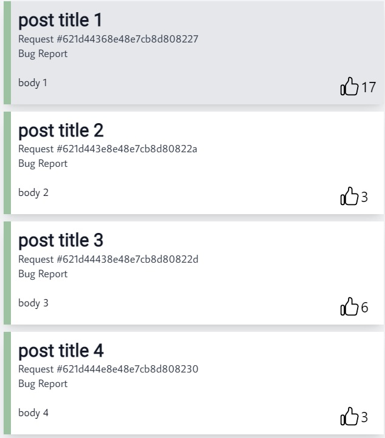
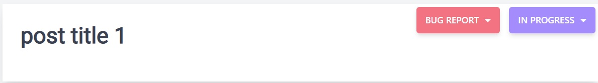
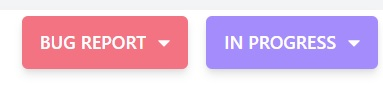
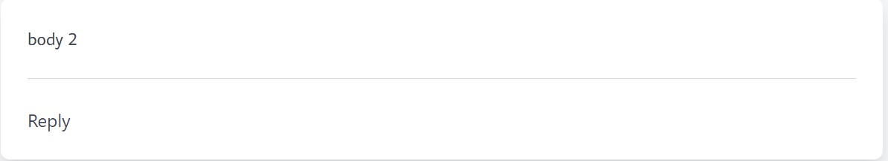
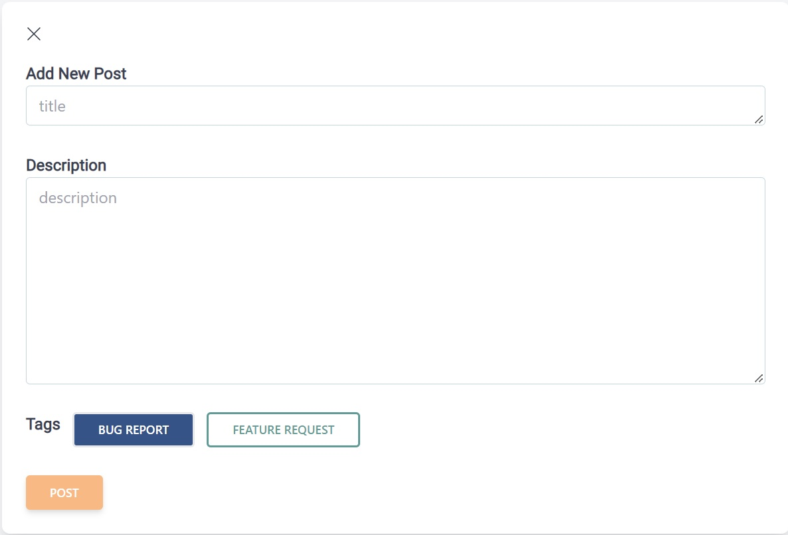

# Buggo

Buggo provides better way for users to submit their complaints and issues with platforms and services

## User Manual

You can access our app [here](https://buggo.netlify.app/)

* Open the app and it will direct you to the landing page. From here you can see
the left has posts of bug reports or feature requests made by other uses.
* The top left has a "new" button where a user can make a new post.
* When the button is clicked, a template to the right will be shown
* From here you can add a title, a description, and select which tag
the post is for.
* The new post will currently be put at the bottom of the list (plan to change in future).
* Click on a post to have it show up on the right side.
* You can also sign up for an account on the top right.
* The account will be stored as a cookie in your browser so you won't have to log back in
after exiting the app.
* You can either be a developer, which gives access to changing the progress of a post that
shows in the top right of a post.
* If you're just a regular user then you will still be able to see the progress, but cannot
change it.

## Frontend Reference

### PostPreview

* PostPreview is a card that gives basic information about the post

### UpVote

* A liking system for the posts.
* One like per post for an account.

### PostList

* PostList helps with organizing all of the PostPreview cards into a list.

### PostTitle

* The title of a post displayed on the left side of the app when a post is selected
* In the top right corner there is also a PostInfo section.

### PostInfo

* Tags giving information about the post
* Whether the post is a bug report or a feature request
* Also what progress the post is on (Reported/In Progress/Resolved)

### PostBody

* The body of a post displayed on the left side of the app when a post is selected
* Comments can be left on the body of a post

### SidebarHeader

* Searchbar that does not have logic fully implemented.

### NewPostButton

* Button to activate to show a template of making a new post

### NewPost

* The card that gives a template to user for how to make a new post

### NavBar

* NavBar consists of LogoTitle to the left and a Sign In/Sign up navigation bar to the right.
* The account logic can be found in the src/NavBar/ModalPopup folder.

## API Reference

### **Post Routes** (refers to Buggo posts, not to be confused with HTTP POST)

#### Get a Post
| Route      | Tags | Return                        | Req Query                                                                      | Req Body                     | Notes                                                                                                                           |
| ---------- | ---- | ----------------------------- | ------------------------------------------------------------------------------ | ---------------------------- | ------------------------------------------------------------------------------------------------------------------------------- |
| /api/posts | GET  | An array posts                | `limit`, `skip`, `fields`, `sort`, `post_type`, `post_status`, `title_matches` | title, body, post_type, user | `user` is the user id. `body` is text message. `title` is text message. `post_type` is either `Bug Report` or `Feature Request` |

#### Add a Post
| Route      | Tags | Return                        | Req Query                                                                      | Req Body                     | Notes                                                                                                                           |
| ---------- | ---- | ----------------------------- | ------------------------------------------------------------------------------ | ---------------------------- | ------------------------------------------------------------------------------------------------------------------------------- |
| /api/post  | POST | The newly created Post Object |                                                                                | title, body, post_type, user | `user` is the user id. `body` is text message. `title` is text message. `post_type` is either `Bug Report` or `Feature Request` |

#### Update a Post
| Route       | Tags | Return                        | Req Query                                                                     | Req Body                                                     | Notes                                                          |
| ----------  | ---- | ---------- | ------------------ | ------------------------------------------------------------ | -------------------------------------------------------------- |
| /api/update | PUT  |  message: "post updated successfully!"          |                    | title, body, post_type, status, votes, user, list_of_upvotes | This route can modify all post parameters except for post_time |

#### Upvote a Post
| Route       | Tags | Return                        | Req Query                                                                     | Req Body                                                     | Notes                                                          |
| ----------  | ---- | ---------- | ------------------ | ------------------------------------------------------------ | -------------------------------------------------------------- |
| /api/update/upvote | PUT  |   message: "post upvoted successfully!"         |                    | postID, email, cost | This route updates post upvote |

#### Get Post Subscription Status
| Route       | Tags | Return                        | Req Query                                                                     | Req Body                                                     | Notes                                                          |
| ----------  | ---- | ---------- | ------------------ | ------------------------------------------------------------ | -------------------------------------------------------------- |
| /api/posts/:postID/subscription-status | GET  |   subscription status         |   postID                 |  |   |

#### Update Post Subscription Status
| Route       | Tags | Return                        | Req Query                                                                     | Req Body                                                     | Notes                                                          |
| ----------  | ---- | ---------- | ------------------ | ------------------------------------------------------------ | -------------------------------------------------------------- |
| /api/posts/:postID/update-subscription | POST  |  subscription status          |     postID               | subscribe |   |

#### Unsubscribe from a Post
| Route       | Tags | Return                        | Req Query                                                                     | Req Body                                                     | Notes                                                          |
| ----------  | ---- | ---------- | ------------------ | ------------------------------------------------------------ | -------------------------------------------------------------- |
| /api/posts/unsubscribe/:token | GET  |  "You have been unsubscribed from this post!"          |    token                |  |   |

#### Get GitHub Issues
| Route       | Tags | Return                        | Req Query                                                                     | Req Body                                                     | Notes                                                          |
| ----------  | ---- | ---------- | ------------------ | ------------------------------------------------------------ | -------------------------------------------------------------- |
| /api/post/import/issues | POST  |   posts with GitHub issues         |                    | listIssues, project, post_type|   |

### **Comment Routes**

#### Add a Comment
| Route        | Tags | Return                           | Req Query | Req Body             | Notes                                                                                                            |
| ------------ | ---- | -------------------------------- | --------- | -------------------- | ---------------------------------------------------------------------------------------------------------------- |
| /api/comment | POST | The newly created Comment Object |           | postID, body, userID | `postID` is post associated with the comment. `body` is text message. `userID` is user associated with the reply |

#### Get a specific Comment
| Route             | Tags | Return                           | Req Query | Req Body             | Notes                                                                                                            |
| ------------      | ---- | -------------------------------- | --------- | -------------------- | ---------------------------------------------------------------------------------------------------------------- |
| /api/comments/:id | GET  | The Comment Object or null       |           | commentID            | `commentID` is the comment id as stored in the database.                                                         |

#### Get all Comments
| Route             | Tags | Return                                  | Req Query | Req Body             | Notes                                                                                                            |
| ------------      | ---- | --------------------------------------- | --------- | -------------------- | ---------------------------------------------------------------------------------------------------------------- |
| /api/commentsAll  | GET  | A 2-Dimensional Array with all comments |           |                      | The returned 2D array has each comment list mapped to its respective index in the Post List               |

#### Make Comments with GitHub Comments
| Route             | Tags | Return                                  | Req Query | Req Body             | Notes                                                                                                            |
| ------------      | ---- | --------------------------------------- | --------- | -------------------- | ---------------------------------------------------------------------------------------------------------------- |
| /api/comment/github  | POST  | comments created by GitHub comments |           |      postIDList, commentBodyLists, projectID                |               |

### **User Routes** 

#### Partially Update a User
| Route             | Tags | Return                                  | Req Query | Req Body             | Notes                                                                                                            |
| ------------      | ---- | --------------------------------------- | --------- | -------------------- | ---------------------------------------------------------------------------------------------------------------- |
| /api/users/currentuser | PATCH  | current user |           |                      |   partially update user            |

#### Get Current User
| Route             | Tags | Return                                  | Req Query | Req Body             | Notes                                                                                                            |
| ------------      | ---- | --------------------------------------- | --------- | -------------------- | ---------------------------------------------------------------------------------------------------------------- |
| /api/users/currentuser | GET  | current user |           |                      |  get current user          |

#### Signup a User
| Route             | Tags | Return                                  | Req Query | Req Body             | Notes                                                                                                            |
| ------------      | ---- | --------------------------------------- | --------- | -------------------- | ---------------------------------------------------------------------------------------------------------------- |
| /api/users/signup | POST  | token, user |           |     email, password, role                 |          |

#### Signin a User
| Route             | Tags | Return                                  | Req Query | Req Body             | Notes                                                                                                            |
| ------------      | ---- | --------------------------------------- | --------- | -------------------- | ---------------------------------------------------------------------------------------------------------------- |
| /api/users/signin | POST  | token, user |           |     email, password                 |          |

#### Get User Projects
| Route             | Tags | Return                                  | Req Query | Req Body             | Notes                                                                                                            |
| ------------      | ---- | --------------------------------------- | --------- | -------------------- | ---------------------------------------------------------------------------------------------------------------- |
| /api/user/projects | GET  | list of projects of the current user |           |     |          |

### **Project Routes** 

#### Create a New Project
| Route             | Tags | Return                                  | Req Query | Req Body             | Notes                                                                                                            |
| ------------      | ---- | --------------------------------------- | --------- | -------------------- | ---------------------------------------------------------------------------------------------------------------- |
|/api/project | POST  | the new project |           | name, urlLogo, email     |          |

#### Get All Projects
| Route             | Tags | Return                                  | Req Query | Req Body             | Notes                                                                                                            |
| ------------      | ---- | --------------------------------------- | --------- | -------------------- | ---------------------------------------------------------------------------------------------------------------- |
| /api/allProjects | GET  | list of all projects |           |    |          |

#### Add Developers to Project
| Route             | Tags | Return                                  | Req Query | Req Body             | Notes                                                                                                            |
| ------------      | ---- | --------------------------------------- | --------- | -------------------- | ---------------------------------------------------------------------------------------------------------------- |
| /api/project/addDeveloper | POST  | the updated project | |  email, projectId  |          |

### **Media Routes** 

#### Upload Media 
| Route             | Tags | Return                                  | Req Query | Req Body             | Notes                                                                                                            |
| ------------      | ---- | --------------------------------------- | --------- | -------------------- | ---------------------------------------------------------------------------------------------------------------- |
| /api/media/upload | POST  | message: "media uploaded successfully!" | |  |          |

### **Oauth Routes** 

#### Get Access Token from GitHub
| Route             | Tags | Return                                  | Req Query | Req Body             | Notes                                                                                                            |
| ------------      | ---- | --------------------------------------- | --------- | -------------------- | ---------------------------------------------------------------------------------------------------------------- |
| /api/auth/github-token | POST  | Access Token | |  |          |

#### Authenticate with Google 
| Route             | Tags | Return                                  | Req Query | Req Body             | Notes                                                                                                            |
| ------------      | ---- | --------------------------------------- | --------- | -------------------- | ---------------------------------------------------------------------------------------------------------------- |
| /api/auth/github | POST  | token, user | |  |          |

#### Authenticate with GitHub 
| Route             | Tags | Return                                  | Req Query | Req Body             | Notes                                                                                                            |
| ------------      | ---- | --------------------------------------- | --------- | -------------------- | ---------------------------------------------------------------------------------------------------------------- |
| /api/auth/github | POST  | token, user | |  |          |

#### Authenticate with Google 
| Route             | Tags | Return                                  | Req Query | Req Body             | Notes                                                                                                            |
| ------------      | ---- | --------------------------------------- | --------- | -------------------- | ---------------------------------------------------------------------------------------------------------------- |
| /api/auth/google | POST  | token, user | |  |          |

### **Widget Routes** 

#### Create a Widget Post
| Route             | Tags | Return                                  | Req Query | Req Body             | Notes                                                                                                            |
| ------------      | ---- | --------------------------------------- | --------- | -------------------- | ---------------------------------------------------------------------------------------------------------------- |
| /api/widget/post | POST  | post, message: "widget post created successfully!" | | title, body, post_type, project |          |

## About Us!

#### Mark Tiavises

Mark is a junior majoring in Computer Science. Hoping to develop professional skills in web developemnt and AI/ML. Outside of school, he likes playing board and
card games like Exploding Kittens 💣😿 and Here to Slay 🐻.

#### Elva Shang

Elva is a sophomore majoring in Applied Math & Statistics and Computer Science. Outside of school, she likes playing squash and doing embroidery. She's a big fan of Winnie the Pooh.

#### Chinat Yu

My name is Chinat Yu. I am a Computer Science major 2023 undergrad at Hopkins. is Chinat Yu. I am a Computer Science major 2023 undergrad at Hopkins. As a Hopkins student for the class of 2023, I am a Computer Science major with an interest in going into learning analytics and education technologies. I have always been fascinated by the way that people learn and apply their knowledge. I hope to use technology to close the education inequity gap and well as optimizing the way people learn.

#### Karen He

Karen is a junior majoring in Biomedical Engineering and Computer Science. Outside of school, she likes to travel and spend time with friends. She is also a big fan of seals.

#### Jacky Wang

Jacky is a freshman Computer Science major who is interested in backend development and working with cloud technologies. Outside of school, he enjoys playing tennis.

#### William Tong

Will is a sophomore majoring in Computer Science at JHU. In his free time, he enjoys playing basketball and listening to lofi music. He also has one brother and a dog.
